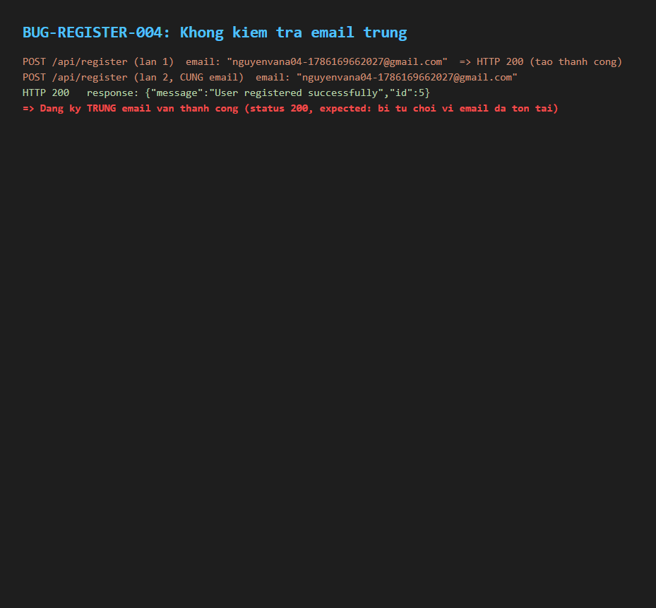

# BUG-REGISTER-004: Không kiểm tra email trùng khi đăng ký — cho phép tạo nhiều tài khoản cùng email

## Found by Test Case

TC-REGISTER-004

## Requirement liên quan

FR-01 (Đăng ký tài khoản — Email phải là duy nhất trong hệ thống)

## Severity / Priority

Critical / P1

## Environment

- Browser: Chromium, Firefox, WebKit — tái hiện trên cả 3
- OS: Windows 11
- URL: API: POST http://localhost:3000/api/register
- Build: nhánh `hw04/23127211`, commit `3d2a86d`

## Steps to reproduce

1. Gọi `POST /api/register` với một email tạm (chưa tồn tại) + mật khẩu hợp lệ → xác nhận tạo thành công (201/200).
2. Gọi lại `POST /api/register` với **cùng email đó** một lần nữa.

## Expected result

Lần gọi thứ 2 bị từ chối với lỗi "Email đã tồn tại"; không tạo bản ghi trùng.

## Actual result

Lần gọi thứ 2 vẫn thành công (`res.ok() === true`), tạo thêm một bản ghi `users` thứ hai với cùng địa chỉ email. Xác nhận qua source: bảng `users` (`backend/database.js`) không khai báo ràng buộc `UNIQUE` trên cột `email`, và `POST /api/register` (`backend/server.js:20-30`) không truy vấn kiểm tra trùng trước khi `INSERT`.

## Evidence

- HTML report: `tests/e2e/reports/html/register-chromium/index.html` — test `TC-REGISTER-004: Email da duoc dang ky (trung, ...)` (Failed): `expect(duplicate.ok()).toBe(false)` nhận `true`.

## Notes

- Test dùng một email **tạm/riêng** (không phải tài khoản mặc định `test@eshop.com`) để không làm nhiễu dữ liệu đăng nhập dùng chung với các spec cart/product.
- Hậu quả tiềm ẩn: đăng nhập bằng email trùng có thể trả về bản ghi không xác định (tuỳ thứ tự SQLite trả về), gây rủi ro bảo mật/toàn vẹn dữ liệu.
