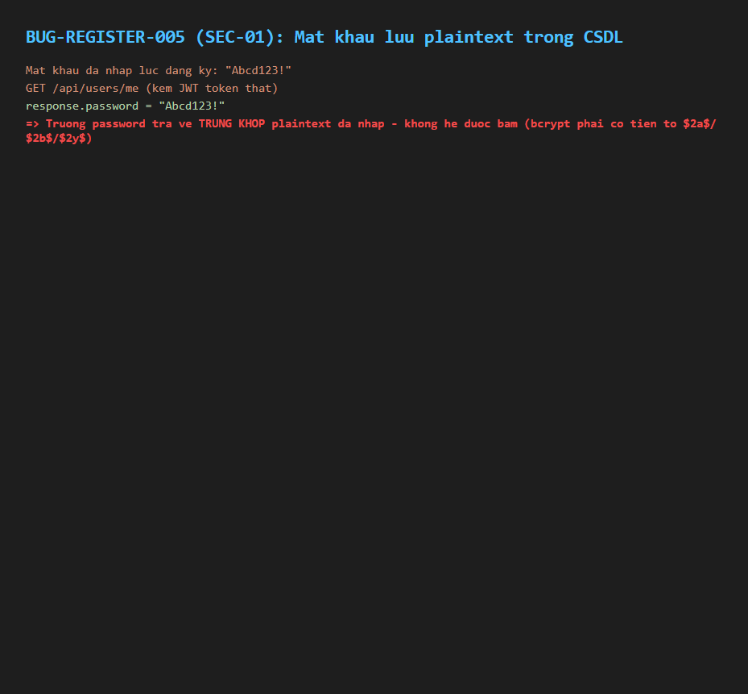

# BUG-REGISTER-005 (SEC-01): Mật khẩu được lưu dạng plaintext trong CSDL, không hash

## Found by Test Case

TC-REGISTER-017 (SEC-01)

## Requirement liên quan

FR-01 / SEC-01 (Mật khẩu phải được băm — bcrypt hoặc tương đương — không được lưu dạng plaintext)

## Severity / Priority

Blocker / P0

## Environment

- Browser: N/A (kiểm tra tầng API/CSDL)
- OS: Windows 11
- URL: API: POST http://localhost:3000/api/register, POST /api/login, GET /api/users/me
- Build: nhánh `hw04/23127211`, commit `3d2a86d`

## Steps to reproduce

1. Đăng ký tài khoản mới qua `POST /api/register` với mật khẩu `Abcd123!`.
2. Đăng nhập bằng tài khoản vừa tạo, lấy JWT token.
3. Gọi `GET /api/users/me` kèm token, đọc trường `password` trong response.

## Expected result

Trường `password` trả về là chuỗi đã băm (ví dụ có tiền tố bcrypt `$2a$`/`$2b$`/`$2y$`), khác hoàn toàn với plaintext `Abcd123!` đã nhập.

## Actual result

Trường `password` trả về **chính xác plaintext** `Abcd123!` — không hề được băm. Xác nhận qua source: `backend/server.js` — endpoint `/api/login` so sánh trực tiếp `user.password === password` (không dùng `bcrypt.compare` hay tương đương), và `POST /api/register` lưu thẳng `password` nhận từ request vào cột `password` mà không băm trước khi `INSERT`. `GET /api/users/me` (`server.js:112-116`) trả về nguyên object user từ CSDL, bao gồm cả trường `password` plaintext.

## Evidence

- HTML report: `tests/e2e/reports/html/register-chromium/index.html` (và firefox/webkit) — test `TC-REGISTER-017: SEC-01 - Mat khau khong duoc luu plaintext trong CSDL` (Failed): `expect(me.password).not.toBe(secCase.input.password)` thất bại (giá trị bằng nhau); `expect(me.password).toMatch(/^\$2[aby]\$/)` cũng thất bại.

## Notes

Đây là lỗi bảo mật nghiêm trọng nhất trong 3 feature được kiểm: rò rỉ mật khẩu plaintext qua endpoint `GET /api/users/me` là rủi ro cao nếu bị khai thác (lộ mật khẩu thật của người dùng, không chỉ là hash có thể chống lại phần nào). Đề xuất ưu tiên vá đầu tiên.
