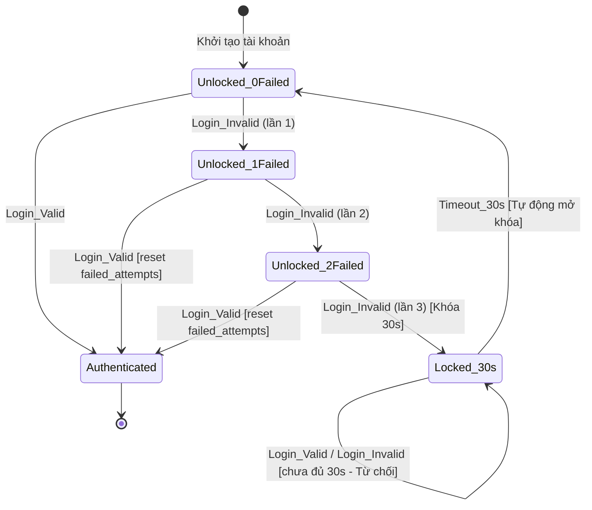

# State Transition Testing — Test Design Documentation

## Feature: FR-02 — Đăng nhập & Khóa tài khoản (Authentication & Account Locking)

### 1. Tóm tắt Phân tích (States & Events)

- **Trạng thái (States)**:
  - `Unlocked (0 failed)`: Trạng thái bình thường, số lần đăng nhập sai = 0 (Initial State).
  - `Unlocked (1 failed)`: Trạng thái bình thường, số lần đăng nhập sai = 1.
  - `Unlocked (2 failed)`: Trạng thái bình thường, số lần đăng nhập sai = 2.
  - `Locked (30s)`: Trạng thái tài khoản bị khóa tạm thời 30 giây do đăng nhập sai 3 lần liên tiếp.
  - `Authenticated`: Trạng thái đã đăng nhập thành công, nhận JWT Token (Terminal / Active Session State).
- **Sự kiện (Events)**:
  - `Login_Valid`: Đăng nhập với Email và Mật khẩu đúng.
  - `Login_Invalid`: Đăng nhập với Email hoặc Mật khẩu sai.
  - `Timeout_30s`: Thời hạn tạm khóa 30 giây kết thúc.

---

### 2. State Transition Table

| Trạng thái hiện tại   | Sự kiện         | Trạng thái tiếp theo  | Hợp lệ?      |
| --------------------- | --------------- | --------------------- | ------------ |
| `Unlocked (0 failed)` | `Login_Valid`   | `Authenticated`       | Y            |
| `Unlocked (0 failed)` | `Login_Invalid` | `Unlocked (1 failed)` | Y            |
| `Unlocked (0 failed)` | `Timeout_30s`   | -                     | N (invalid)  |
| `Unlocked (1 failed)` | `Login_Valid`   | `Authenticated`       | Y            |
| `Unlocked (1 failed)` | `Login_Invalid` | `Unlocked (2 failed)` | Y            |
| `Unlocked (1 failed)` | `Timeout_30s`   | -                     | N (invalid)  |
| `Unlocked (2 failed)` | `Login_Valid`   | `Authenticated`       | Y            |
| `Unlocked (2 failed)` | `Login_Invalid` | `Locked (30s)`        | Y            |
| `Unlocked (2 failed)` | `Timeout_30s`   | -                     | N (invalid)  |
| `Locked (30s)`        | `Login_Valid`   | `Locked (30s)`        | N (invalid)  |
| `Locked (30s)`        | `Login_Invalid` | `Locked (30s)`        | N (invalid)  |
| `Locked (30s)`        | `Timeout_30s`   | `Unlocked (0 failed)` | Y            |
| `Authenticated`       | `Login_Valid`   | `Authenticated`       | N (terminal) |
| `Authenticated`       | `Login_Invalid` | `Authenticated`       | N (terminal) |

---

### 3. State Diagram

---

### 4. Danh sách Test Cases tổng hợp

| Test Case ID     | Loạt Bao phủ (Coverage)     | Trạng thái ban đầu                                 | Sự kiện         | Trạng thái mong đợi        | File Test Case                                            |
| ---------------- | --------------------------- | -------------------------------------------------- | --------------- | -------------------------- | --------------------------------------------------------- |
| `TC-AUTH-STT-01` | Valid Transition (0-switch) | `Unlocked (0 failed)`                              | `Login_Valid`   | `Authenticated`            | [TC-AUTH-STT-01.md](../test-cases/auth/TC-AUTH-STT-01.md) |
| `TC-AUTH-STT-02` | Valid Transition (0-switch) | `Unlocked (0 failed)`                              | `Login_Invalid` | `Unlocked (1 failed)`      | [TC-AUTH-STT-02.md](../test-cases/auth/TC-AUTH-STT-02.md) |
| `TC-AUTH-STT-03` | Valid Transition (0-switch) | `Unlocked (1 failed)`                              | `Login_Valid`   | `Authenticated`            | [TC-AUTH-STT-03.md](../test-cases/auth/TC-AUTH-STT-03.md) |
| `TC-AUTH-STT-04` | Valid Transition (0-switch) | `Unlocked (1 failed)`                              | `Login_Invalid` | `Unlocked (2 failed)`      | [TC-AUTH-STT-04.md](../test-cases/auth/TC-AUTH-STT-04.md) |
| `TC-AUTH-STT-05` | Valid Transition (0-switch) | `Unlocked (2 failed)`                              | `Login_Valid`   | `Authenticated`            | [TC-AUTH-STT-05.md](../test-cases/auth/TC-AUTH-STT-05.md) |
| `TC-AUTH-STT-06` | Valid Transition (0-switch) | `Unlocked (2 failed)`                              | `Login_Invalid` | `Locked (30s)`             | [TC-AUTH-STT-06.md](../test-cases/auth/TC-AUTH-STT-06.md) |
| `TC-AUTH-STT-07` | Invalid Transition          | `Locked (30s)`                                     | `Login_Valid`   | `Locked (30s)` (Không đổi) | [TC-AUTH-STT-07.md](../test-cases/auth/TC-AUTH-STT-07.md) |
| `TC-AUTH-STT-08` | Invalid Transition          | `Locked (30s)`                                     | `Login_Invalid` | `Locked (30s)` (Không đổi) | [TC-AUTH-STT-08.md](../test-cases/auth/TC-AUTH-STT-08.md) |
| `TC-AUTH-STT-09` | Valid Transition (0-switch) | `Locked (30s)`                                     | `Timeout_30s`   | `Unlocked (0 failed)`      | [TC-AUTH-STT-09.md](../test-cases/auth/TC-AUTH-STT-09.md) |
| `TC-AUTH-STT-10` | N-switch Sequence           | `Locked (30s)` -> Timeout -> `Unlocked (0 failed)` | `Login_Valid`   | `Authenticated`            | [TC-AUTH-STT-10.md](../test-cases/auth/TC-AUTH-STT-10.md) |
